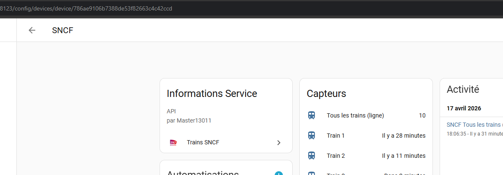
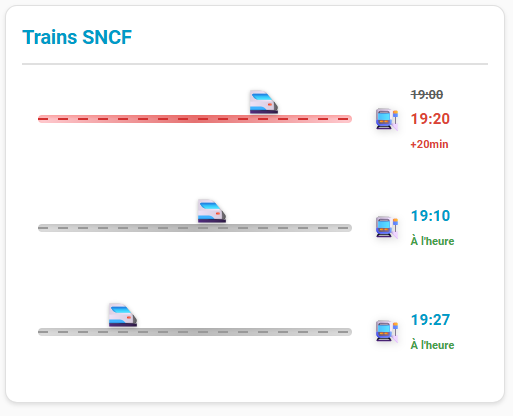

# 🚆 SNCF Trains pour Home Assistant

Suivez facilement les horaires des trains SNCF entre deux gares directement dans votre tableau de bord Home Assistant, grâce à l’API officielle de la [SNCF](https://www.digital.sncf.com/startup/api).

Départs, arrivées, retards, durée du trajet et type de train (TER, TGV, etc.) : toutes les informations essentielles sont regroupées dans une interface personnalisable et entièrement traduite en français.

> [!CAUTION]
>
> ### ⚠️ DÉVELOPPEMENT ACTIF / ACTIVE DEVELOPMENT
>
> **Ce projet est actuellement en phase d'amélioration intensive.**
> Les fonctionnalités évoluent rapidement. Assurez-vous d'utiliser la dernière version des fichiers de l'intégration pour garantir une compatibilité totale avec votre tableau de bord.

---

## 🧪 Nouveauté en phase de test : Les Trains Supprimés

> **Nous avons récemment introduit la détection et l'affichage des trains annulés/supprimés !** > Cette fonctionnalité est actuellement en **phase de test**.
>
> 🙏 **Un immense merci** à tous les utilisateurs qui prennent le temps de nous faire leurs retours (qu'il s'agisse de petits bugs ou de succès sur vos trajets quotidiens). C'est grâce à votre aide que nous pouvons stabiliser et améliorer ce projet pour tout le monde !

---

## 🚀 Dernières mises à jour (Avril 2026)

Le système a été lourdement mis à jour pour vous offrir une précision et un confort d'utilisation optimaux :

- **🕒 Correction de l'affichage de l'heure :** Résolution définitive du problème qui affichait des trains "il y a 8 heures". Le système gère désormais parfaitement les fuseaux horaires locaux.
- **📡 Radar de Ligne (V3.3) :** Intégration d'un visuel détaillé affichant les arrêts intermédiaires et détectant les modifications de parcours. _(Note : Cette option peut être désactivée dans les paramètres pour garder un design simple)._
- **🎭 Moteur d'Animation Dynamique :** L'emoji du train avance désormais de manière synchronisée avec la durée réelle de votre trajet.
- **🔍 Analyse Intelligente des Perturbations :** \* Affichage clair de la **cause officielle** du retard (ex: Panne de signalisation, Défaut d'alimentation...).
  - Code couleur intuitif : **Orange** pour les retards, **Rouge** pour les suppressions.

---

## 📸 Aperçu Visuel

|                                              Design Épuré (Classique)                                               |                                                 Nouveau Design (Radar de Ligne)                                                 |
| :-----------------------------------------------------------------------------------------------------------------: | :-----------------------------------------------------------------------------------------------------------------------------: |
|  |  |

### ⚠️ Zoom sur les Retards et Perturbations

Grâce à la nouvelle analyse des données de la SNCF, la carte est capable d'afficher le suivi en temps réel des incidents avec la cause exacte et l'impact sur chaque arrêt :


---

## 📦 Installation

### 1. Via HACS (Méthode recommandée)

_Nécessite [HACS](https://hacs.xyz/) installé sur votre Home Assistant._

1. Ouvrez **HACS** dans votre menu de gauche.
2. Recherchez **SNCF Trains**.
3. Cliquez sur **Installer**, puis redémarrez Home Assistant.

### 2. Méthode Manuelle

1. Téléchargez le contenu de ce dépôt.
2. Copiez le dossier `sncf_trains` dans le répertoire `config/custom_components/` de votre Home Assistant.
3. Redémarrez Home Assistant.

---

## ⚙️ Configuration initiale

1. Dans Home Assistant, allez dans **Paramètres** → **Appareils et services** → **Ajouter une intégration**.
2. Recherchez **SNCF Trains**.
3. Renseignez votre **Clé API SNCF** _(voir section suivante)_.
4. Configurez votre premier trajet en indiquant :
   - La gare de départ.
   - La gare d'arrivée.
   - La plage horaire que vous souhaitez surveiller.

_Astuce : Vous pouvez configurer autant de trajets différents que vous le souhaitez !_

---

## 🔐 Obtenir sa Clé API SNCF (Gratuit)

Pour que l'intégration fonctionne, vous avez besoin d'une clé API officielle fournie par la SNCF :

1. Rendez-vous sur le [portail API SNCF](https://www.digital.sncf.com/startup/api).
2. Créez un compte gratuitement ou connectez-vous.
3. Générez votre clé API (celle-ci autorise jusqu'à 5 000 requêtes par jour, ce qui est largement suffisant).
4. Copiez-la et collez-la lors de la configuration dans Home Assistant.

> _Pour changer de clé plus tard, il vous suffira de cliquer sur **Reconfigurer** depuis la page de l'intégration._

---

## 🧩 Options et Personnalisation

Vous pouvez ajuster le comportement de l'intégration sans avoir à redémarrer Home Assistant :

**Options globales de l'intégration :**

- ⏱ **Intervalle de rafraîchissement (actif) :** Fréquence de mise à jour pendant vos heures de trajet (défaut : 2 min).
- 🕰 **Intervalle de rafraîchissement (repos) :** Fréquence de mise à jour hors de vos heures de trajet (défaut : 60 min).

**Options spécifiques à chaque trajet :**

- 🚆 **Nombre de trains à afficher :** Choisissez combien de départs simultanés vous souhaitez surveiller **(jusqu'à 20 trains par ligne maximum !)**.
- 🕗 **Heures exactes de début et fin de surveillance.**

_(Le mode actif se déclenche automatiquement 2 heures avant l'heure de début que vous avez configurée)._

---

## 📊 Données et Capteurs

L'intégration crée automatiquement plusieurs capteurs pour vos automatisations :

- `sensor.sncf_<gare_dep>_<gare_arr>` : Le capteur global résumant votre trajet.
- `sensor.sncf_train_X_<gare_dep>_<gare_arr>` : Un capteur individuel pour chaque train suivi.
- `calendar.trains` : Un calendrier pratique affichant vos prochains départs.

**Informations disponibles pour chaque train :**

- Heure de départ prévue et réelle.
- Heure d’arrivée.
- Durée totale du voyage.
- Type de train (TER, TGV...), direction et numéro de ligne.
- Minutes de retard et cause officielle (si applicable).

---

## 🎨 Carte pour le Tableau de Bord (Lovelace)

Une jolie carte visuelle (`sncf-train-card`) est incluse et prête à l'emploi dès l'installation !

### Trouver son `device_id`

Pour que la carte sache quel trajet afficher, elle a besoin de l'identifiant de l'appareil (`device_id`) :

1. Allez dans **Paramètres** → **Appareils et services** → **SNCF Trains**.
2. Cliquez sur l'appareil correspondant à votre trajet.
3. Regardez l'URL dans la barre de votre navigateur : la suite de lettres et chiffres à la fin est votre `device_id` (ex: `.../config/devices/device/abc123def456`).

### Configuration YAML Avancée

<<<<<<< HEAD
Voici un exemple de configuration complet pour exploiter 100% des capacités de la carte :
=======
---

## 🎨 Carte Lovelace — SNCF Train Card

La carte `sncf-train-card` est **automatiquement disponible** dans le sélecteur de cartes dès l'installation de l'intégration.

### Ajouter la carte

Dans un tableau de bord, cliquer sur **+ Ajouter une carte** → chercher **SNCF Train Card**.

La configuration peut ensuite se faire :

- via l'éditeur visuel Lovelace
- ou via YAML

Ou en YAML :
>>>>>>> origin/fetch-evolves

```yaml
type: custom:sncf-train-card
device_id: VOTRE_DEVICE_ID
<<<<<<< HEAD
=======
```

### 🔍 Trouver le `device_id`

_S'obtient dynamiquement via la configuration visuelle._

Le `device_id` correspond à l'appareil créé lors de la configuration du trajet.

1. Aller dans **Paramètres → Appareils & services → SNCF Trains**
2. Cliquer sur le trajet souhaité
3. L'URL contient l'identifiant : `.../config/devices/device/XXXX`

> 

### ⚙️ Paramètres de la carte

| Paramètre | Type | Défaut | Description |
|-----------|------|--------|-------------|
| `device_id` | `string` | **obligatoire** | Identifiant de l'appareil SNCF (voir ci-dessus) |
| `title` | `string` | `'Trains SNCF'` | Titre affiché en haut de la carte |
| `train_lines` | `number` | `3` | Nombre de trains affichés simultanément |
| `animation_duration` | `number` | `30` | Nombre de minutes avant l'arrivée en gare à partir duquel l'animation du train se déclenche (ex : `30` = animation active dans les 30 dernières minutes, `60` = dans la dernière heure) |
| `update_interval` | `number` | `30000` | Intervalle de rafraîchissement de la carte en **millisecondes** |
| `train_emoji_axial_symmetry` | `boolean` | `true` | Retourne l'emoji du train horizontalement |
| `train_emoji` | `string` | `'🚅'` | Emoji du train animé sur la barre |
| `show_departure_station` | `boolean` | `true` | Affiche ou masque les informations de départ |
| `departure_station_emoji` | `string` | `''` | Emoji de la station de départ |
| `show_arrival_station` | `boolean` | `true` | Affiche ou masque les informations d'arrivée |
| `arrival_station_emoji` | `string` | `'🚉'` | Emoji de la station d'arrivée |

### Exemple complet

```yaml
type: custom:sncf-train-card
device_id: abc123def456
>>>>>>> origin/fetch-evolves
title: "Paris → Lyon"
train_lines: 5
train_emoji: "🚆"
train_emoji_axial_symmetry: true
show_departure_station: true
departure_station_emoji: "🚉"
show_arrival_station: true
arrival_station_emoji: "🏙️"
animation_duration: 0
update_interval: 60000
show_route_details: true
use_real_duration: true
show_real_stop_times: true
show_delay_cause: true
```

**🔍 QUE FAIT CHAQUE OPTION ?**

<<<<<<< HEAD
- train_lines: 5 : Affiche les 5 prochains départs sur votre tableau de bord.
- train_emoji: "🚆" : Remplace l'icône du train par défaut par l'emoji de votre choix.
- train_emoji_axial_symmetry: true : Retourne l'emoji horizontalement (très utile si vous voulez donner l'impression que le train roule vers la gauche).
- train_station_emoji: "🏙️" : Affiche cet emoji à côté du nom de la gare.
- animation_duration: 45 : L'animation du train qui avance sur la ligne démarrera exactement 45 minutes avant le départ.
- update_interval: 60000 : La carte se rafraîchit visuellement toutes les 60 secondes (60000 ms).
- show_route_details: true : Active le Radar de Ligne ! Affiche une timeline sous le trajet principal avec tous les arrêts intermédiaires de votre train.
- use_real_duration: true : Ajuste la vitesse de l'animation en fonction du temps de trajet réel. Un trajet de 2h paraîtra visuellement plus lent qu'un trajet de 15 minutes.
- show_real_stop_times: true : Sur le radar de ligne, en cas de retard, affiche l'heure initiale (barrée) suivie de la nouvelle heure estimée (en orange) pour chaque arrêt intermédiaire.
- show_delay_cause: true : Affiche clairement le motif du retard (ex: Panne de signalisation, Obstacle sur les voies) juste en dessous du temps de retard.
=======


>>>>>>> origin/fetch-evolves

---

## 🔮 Roadmap / À venir

🛤️ Pour les grands voyageurs : L'ajout de l'affichage des voies de départ et d'arrivée est actuellement en cours de réflexion. C'est une fonctionnalité qui s'avère beaucoup plus complexe à mettre en place de manière fiable . Restez à l'écoute !

## 👨‍💻 Développement et Contribution

Compatible avec Home Assistant 2025.8 et supérieur.

Développé par Master13011.

Les contributions sont les bienvenues ! N'hésitez pas à ouvrir une Issue pour signaler un problème ou soumettre une Pull Request.

## 📄 LICENCE

Ce projet est open-source et distribué sous la licence MIT.
